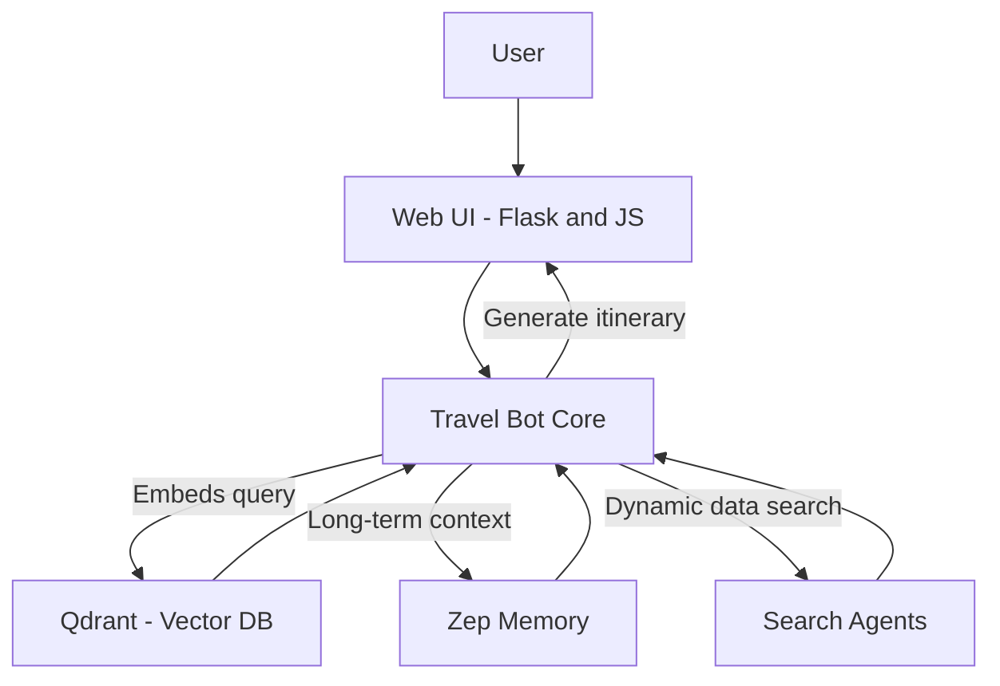

# 🛫 Travel Bot

An **AI-powered travel assistant** that helps users plan trips by suggesting destinations, accommodations, activities, and more — all tailored to their preferences, budget, and travel style.  
Built with **Agentic RAG**, semantic search, long-term memory, and a custom trip planning engine.

---

## 📖 Table of Contents
- [About](#-about)
- [Features](#-features)
- [Architecture](#-architecture)
- [Custom Trip Feature](#-custom-trip-feature)
- [Installation](#-installation)
- [Usage](#-usage)
- [Screenshots](#-screenshots)
- [Contributing](#-contributing)
- [License](#-license)

---

## 📌 About
Travel Bot is a **smart trip planner** that goes beyond static recommendations.  

It combines **AI with search and memory** to give you more than a one-time response:
- Uses **Agentic RAG (Retrieval-Augmented Generation)** to dynamically retrieve the best travel knowledge for your query.  
- Stores **long-term memory with Zep**, remembering your past preferences and travel style (e.g., budget traveler, foodie, adventure seeker).  
- Performs **semantic search with Qdrant** to find the most relevant travel data.  
- Integrates **search agents** to pull external, real-world information (destinations, restaurants, accommodations).  
- Features a **custom trip planner** that builds detailed itineraries based on **budget, duration, location, and preferences**.  

---

## ✨ Features
- ✅ Personalized trip recommendations with AI  
- 🌍 Multi-destination support  
- ⚡ Fast semantic search powered by Qdrant  
- 🧠 Long-term memory powered by Zep (remembers your style)  
- 🔎 Search agents to gather live travel data  
- 🎯 **Custom trip planning** (budget + duration + preferences)  
- 🖼️ Modern web interface (Flask + HTML/CSS/JS)  
- 🔒 Secure session handling  
## 🏗 Architecture



## 🛠 Installation
```bash
# Clone the repository
git clone https://github.com/your-username/travel-bot.git

# Go into the project folder
cd travel-bot

# (Optional) Create virtual environment
python -m venv venv
source venv/bin/activate   # On Linux/Mac
venv\Scripts\activate      # On Windows

# Install dependencies
pip install -r requirements.txt
